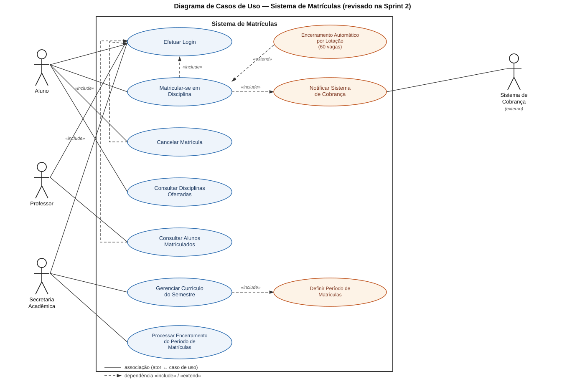
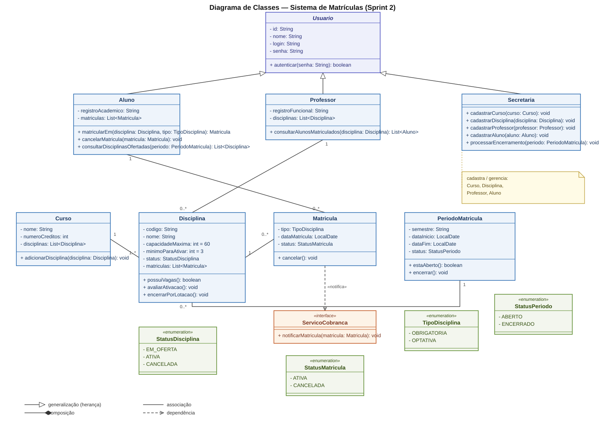

# Sistema de Matrículas

Projeto acadêmico da disciplina **Projeto de Software**, do curso de Engenharia de Software da PUC Minas.

O sistema apoia a gestão acadêmica de uma universidade: a secretaria organiza cursos e disciplinas, os alunos montam sua grade e os professores consultam as turmas. O projeto contém a documentação do domínio, os diagramas UML e um protótipo funcional em Java.

## Sumário

- [Visão geral](#visão-geral)
- [Regras de negócio](#regras-de-negócio)
- [Casos de uso](#casos-de-uso)
- [Histórias de usuário](#histórias-de-usuário)
- [Diagramas](#diagramas)
- [Arquitetura do código](#arquitetura-do-código)
- [Como executar](#como-executar)
- [Testes](#testes)
- [Estrutura do repositório](#estrutura-do-repositório)
- [Estado do projeto](#estado-do-projeto)

## Visão geral

Durante o período de matrículas, o aluno consulta as disciplinas ofertadas, inscreve-se nas opções desejadas e pode cancelar suas matrículas enquanto o período estiver aberto. Ao final, o sistema avalia a quantidade de inscritos de cada disciplina para decidir se ela será oferecida no semestre seguinte.

A matrícula aprovada também gera uma notificação para o sistema externo de cobrança.

## Regras de negócio

| Código | Regra |
| --- | --- |
| RN01 | Um aluno pode se matricular em até 4 disciplinas obrigatórias e 2 optativas. |
| RN02 | Matrículas e cancelamentos só podem ocorrer durante o período vigente. |
| RN03 | Uma disciplina precisa de pelo menos 3 alunos inscritos para ser ativada no semestre seguinte. |
| RN04 | Cada disciplina possui no máximo 60 vagas. Ao atingir o limite, novas inscrições são bloqueadas. |
| RN05 | Toda matrícula concluída deve notificar o sistema externo de cobrança. |
| RN06 | Alunos, professores e secretaria devem autenticar-se com login e senha. |

## Casos de uso

| Caso de uso | Ator | Descrição |
| --- | --- | --- |
| Efetuar login | Aluno, professor e secretaria | Valida o login e a senha do usuário. |
| Consultar disciplinas ofertadas | Aluno | Lista as disciplinas disponíveis no período atual. |
| Matricular-se em disciplina | Aluno | Registra uma matrícula obrigatória ou optativa, respeitando os limites e as vagas. |
| Cancelar matrícula | Aluno | Cancela uma matrícula existente durante o período vigente. |
| Consultar alunos matriculados | Professor | Consulta os alunos inscritos nas disciplinas lecionadas. |
| Gerenciar currículo | Secretaria | Cadastra cursos, disciplinas, professores e alunos. |
| Definir período de matrículas | Secretaria | Define a janela de início e fim das matrículas. |
| Encerrar período | Secretaria | Fecha o período e avalia todas as disciplinas ofertadas. |
| Notificar cobrança | Sistema externo | Recebe os dados de uma matrícula concluída. |

### Atores

- **Aluno:** consulta disciplinas, realiza matrículas e cancela inscrições.
- **Professor:** consulta os alunos matriculados em suas disciplinas.
- **Secretaria acadêmica:** administra o currículo, os usuários e o encerramento do período.
- **Sistema de cobrança:** recebe as notificações de matrículas concluídas.

## Histórias de usuário

### Aluno

- **US01:** Como aluno, quero efetuar login com meu usuário e senha para acessar o sistema.
- **US02:** Como aluno, quero consultar as disciplinas ofertadas para escolher minha grade.
- **US03:** Como aluno, quero me matricular em até 4 disciplinas obrigatórias e 2 optativas.
- **US04:** Como aluno, quero cancelar uma matrícula enquanto o período estiver aberto.
- **US05:** Como aluno, quero que minha matrícula seja enviada automaticamente para cobrança.

### Professor

- **US06:** Como professor, quero efetuar login para acessar as informações acadêmicas.
- **US07:** Como professor, quero consultar os alunos matriculados nas minhas disciplinas.

### Secretaria acadêmica

- **US08:** Como secretaria, quero efetuar login para administrar o sistema.
- **US09:** Como secretaria, quero cadastrar cursos e seus créditos.
- **US10:** Como secretaria, quero cadastrar disciplinas e associá-las aos cursos.
- **US11:** Como secretaria, quero cadastrar alunos e professores para permitir o acesso ao sistema.
- **US12:** Como secretaria, quero definir o período de matrículas de cada semestre.
- **US13:** Como secretaria, quero encerrar o período e avaliar quais disciplinas serão ativadas.

## Diagramas

### Diagrama de casos de uso



### Diagrama de classes



## Arquitetura do código

O protótipo Java segue a estrutura padrão de um projeto Maven e separa as entidades do domínio dos contratos de integração.

| Pacote | Responsabilidade |
| --- | --- |
| `br.pucminas.matriculas` | Ponto de entrada e menu de demonstração. |
| `br.pucminas.matriculas.model` | Entidades `Aluno`, `Professor`, `Secretaria`, `Curso`, `Disciplina`, `Matricula` e `PeriodoMatricula`. |
| `br.pucminas.matriculas.model.enums` | Estados e tipos usados pelas regras de negócio. |
| `br.pucminas.matriculas.servico` | Interface `ServicoCobranca`, que representa a integração externa. |

### Principais entidades

- `Usuario`: classe base para autenticação.
- `Aluno`: controla matrículas e cancelamentos do estudante.
- `Professor`: consulta os alunos de uma disciplina.
- `Secretaria`: administra cadastros e encerramento do período.
- `Curso`: agrupa as disciplinas do currículo.
- `Disciplina`: controla vagas, status e quantidade mínima de inscritos.
- `Matricula`: associa aluno e disciplina, registrando tipo, data e status.
- `PeriodoMatricula`: controla a janela de inscrições e o encerramento do período.
- `ServicoCobranca`: contrato para notificação do sistema externo.

## Como executar

### Requisitos

- Java 25 ou superior
- Maven 3.9 ou superior

### Compilar e testar

Na raiz do repositório:

```powershell
cd projeto-java
mvn clean test
```

### Abrir o sistema

```powershell
cd projeto-java
mvn compile
java -cp target/classes br.pucminas.matriculas.App
```

O programa abre um menu no terminal com as opções abaixo:

| Opção | Ação |
| --- | --- |
| `1` | Consultar disciplinas ofertadas. |
| `2` | Realizar uma matrícula. |
| `3` | Cancelar uma matrícula ativa. |
| `4` | Consultar as próprias matrículas. |
| `5` | Encerrar o período e avaliar as disciplinas. |
| `0` | Sair do sistema. |

### Usuário de demonstração

```text
Login: ana
Senha: 123
```

O sistema inicia com seis disciplinas de demonstração no período `2026.2`. Há três usuários de demonstração:

```text
Aluno:      ana / 123
Professor:  carlos / 123
Secretaria: secretaria / 123
```

## Testes

Os testes automatizados estão em `projeto-java/src/test` e verificam:

- autenticação com login e senha correta e incorreta;
- limite de quatro disciplinas obrigatórias e duas optativas;
- notificação do sistema de cobrança;
- cancelamento de matrícula;
- ativação de disciplina com três ou mais inscritos;
- encerramento do período;
- bloqueio fora do período e ao atingir 60 vagas;
- autorização do professor e definição de período pela secretaria.

Execute a suíte com:

```powershell
cd projeto-java
mvn test
```

## Estrutura do repositório

```text
Sistema-de-maticula/
├── docs/
│   ├── diagrama-caso-de-uso.svg
│   └── diagrama-classes.svg
├── projeto-java/
│   ├── pom.xml
│   └── src/
│       ├── main/java/br/pucminas/matriculas/
│       │   ├── App.java
│       │   ├── model/
│       │   └── servico/
│       └── test/java/br/pucminas/matriculas/
└── README.md
```

## Estado do projeto

O domínio e o menu de demonstração estão implementados e testados. O protótipo utiliza dados carregados em memória ao iniciar; persistência em arquivo, integração HTTP real com cobrança e uma interface gráfica não fazem parte desta versão. Os cadastros de secretaria estão disponíveis pela API de domínio e o menu permite consultar os cadastros e encerrar o período.
